# EFCore.QueryAnalyzer

A **zero-impact**, production-ready NuGet package for monitoring Entity Framework Core query performance with automatic slow query detection, execution plan analysis, and flexible reporting capabilities. Features built-in asynchronous queue processing that eliminates performance overhead on your main application.


## 🚀 Features

- **⚡ Zero Performance Impact** - Built-in asynchronous queue processing moves all analysis to background threads
- **🔄 Background Processing** - Query analysis, execution plan capture, and HTTP reporting happen asynchronously
- **🔍 Real-time Query Detection** - Instantly detects slow queries without blocking your application
- **📊 Execution Plan Analysis** - Captures and analyzes SQL Server execution plans for performance insights
- **🎯 Configurable Thresholds** - Set custom slow query detection thresholds per environment
- **🌐 Multiple Reporting Strategies** - HTTP API, In-Memory, File, and Custom reporting services
- **🔧 Environment-aware Configuration** - Different settings for Development vs Production
- **🧵 Thread-safe Operation** - Concurrent query tracking using `ConcurrentDictionary`
- **🔍 Stack Trace Capture** - Identify problematic code locations with filtered stack traces
- **🗄️ Multi-database Support** - Works with SQL Server, PostgreSQL, MySQL, Oracle, and SQLite
- **🏆 Production-Ready** - Built-in queue architecture ensures your HTTP endpoints maintain full speed

## 📦 Installation

Install the package via NuGet Package Manager:

```bash
dotnet add package EFCore.QueryAnalyzer
```

Or via Package Manager Console:

```powershell
Install-Package EFCore.QueryAnalyzer
```

## 🚀 Quick Start

### 1. Basic Setup with Dependency Injection

```csharp
using EFCore.QueryAnalyzer.Extensions;

var builder = WebApplication.CreateBuilder(args);

// Add the query analyzer with configuration
builder.Services.AddEFCoreQueryAnalyzer(builder.Configuration);

// Configure your DbContext with the analyzer
builder.Services.AddDbContext<MyDbContext>((serviceProvider, options) =>
{
    options.UseSqlServer(connectionString)
           .AddQueryAnalyzer(serviceProvider);
});

var app = builder.Build();
```

> **✨ Performance Boost**: The analyzer now processes all slow queries in the background, ensuring **zero impact** on your application performance! Your HTTP endpoints will maintain full speed while comprehensive query monitoring happens asynchronously.

### 2. Configuration in appsettings.json

```json
{
  "QueryAnalyzer": {
    "ThresholdMilliseconds": 1000,
    "ApiEndpoint": "https://your-monitoring-api.com/slow-queries",
    "ApiKey": "your-secret-api-key",
    "ProjectId": "my-application",
    "CaptureStackTrace": true,
    "CaptureExecutionPlan": true,
    "EnableInDevelopment": true,
    "EnableInProduction": false
  }
}
```

That's it! The analyzer will now monitor your queries and report slow ones automatically in the background with **zero performance impact** on your application.

## ⚙️ Configuration Options

| Option | Type | Default | Description |
|--------|------|---------|-------------|
| `ThresholdMilliseconds` | `double` | `1000` | Threshold in milliseconds for slow query detection |
| `IsEnabled` | `bool` | `true` | Whether the analyzer is enabled |
| `CaptureStackTrace` | `bool` | `true` | Capture stack traces for slow queries |
| `CaptureExecutionPlan` | `bool` | `false` | Capture database execution plans |
| `MaxStackTraceLines` | `int` | `20` | Maximum lines in captured stack traces |
| `MaxQueryLength` | `int` | `10000` | Maximum query text length to store |
| `ApiEndpoint` | `string?` | `null` | HTTP endpoint for reporting slow queries |
| `ApiKey` | `string?` | `null` | API key for authentication |
| `ProjectId` | `string?` | `null` | Project identifier sent as X-PROJECT-ID header |
| `ApiTimeoutMs` | `int` | `5000` | API request timeout in milliseconds |
| `EnableInDevelopment` | `bool` | `true` | Enable reporting in development |
| `EnableInProduction` | `bool` | `false` | Enable reporting in production |
| `DatabaseProvider` | `DatabaseProvider` | `Auto` | Database provider for execution plans |
| `ExecutionPlanTimeoutSeconds` | `int` | `30` | Timeout for execution plan capture |
| `ConnectionString` | `string?` | `null` | Connection string for execution plan capture |

> **Note**: All query analysis and reporting happens asynchronously in background threads, ensuring zero impact on your application's response times.

## 📋 Usage Scenarios

### 1. HTTP API Reporting (Production)

```csharp
builder.Services.AddEFCoreQueryAnalyzerWithHttp(
    options =>
    {
        options.ThresholdMilliseconds = 500;
        options.ApiEndpoint = "https://monitoring.company.com/api/queries";
        options.ApiKey = builder.Configuration["MonitoringApiKey"];
        options.EnableInProduction = true;
    },
    httpClient =>
    {
        httpClient.Timeout = TimeSpan.FromSeconds(10);
        httpClient.DefaultRequestHeaders.Add("X-App-Version", "1.0.0");
    });
```

#### Advanced HTTP Configuration

Configure project identification, custom headers, and enhanced HTTP settings:

```csharp
builder.Services.AddEFCoreQueryAnalyzerWithHttp(
    options =>
    {
        // Basic configuration
        options.ApiEndpoint = "https://monitoring.company.com/api/slow-queries";
        options.ApiKey = builder.Configuration["MonitoringApiKey"];
        
        // Project identification - sent as X-PROJECT-ID header
        options.ProjectId = "my-microservice-api";
        
        // Performance tuning
        options.ApiTimeoutMs = 10000; // 10 second timeout
        options.ThresholdMilliseconds = 500;
        
        // Production settings
        options.EnableInProduction = true;
        options.CaptureExecutionPlan = true;
    },
    httpClient =>
    {
        // HTTP client configuration
        httpClient.Timeout = TimeSpan.FromSeconds(15);
        
        // Custom headers
        httpClient.DefaultRequestHeaders.Add("X-Service-Name", "UserService");
        httpClient.DefaultRequestHeaders.Add("X-Environment", builder.Environment.EnvironmentName);
        httpClient.DefaultRequestHeaders.Add("X-Version", Assembly.GetExecutingAssembly().GetName().Version?.ToString());
        
        // Optional: Configure proxy, certificates, etc.
        // httpClient.DefaultRequestHeaders.Add("X-Correlation-ID", correlationId);
    });
```

The analyzer automatically sets:
- **User-Agent**: `EFCore.QueryAnalyzer/1.0.0`
- **Content-Type**: `application/json`
- **Authorization**: `Bearer {ApiKey}` (when ApiKey is provided)
- **X-PROJECT-ID**: `{ProjectId}` (when ProjectId is provided)

### 2. In-Memory Reporting (Testing/Development)

```csharp
builder.Services.AddEFCoreQueryAnalyzerWithInMemory(options =>
{
    options.ThresholdMilliseconds = 100;
    options.CaptureStackTrace = true;
    options.CaptureExecutionPlan = true;
});

// In tests, access the reports
var reportingService = serviceProvider.GetService<IQueryReportingService>() 
    as InMemoryQueryReportingService;
var reports = reportingService?.GetReports();
```

### 3. Custom Reporting Service

Create and register custom reporting services with flexible service lifetime options:

```csharp
public class DatabaseReportingService : IQueryReportingService
{
    private readonly IDbContextFactory<LoggingDbContext> _dbContextFactory;
    private readonly ILogger<DatabaseReportingService> _logger;

    public DatabaseReportingService(
        IDbContextFactory<LoggingDbContext> dbContextFactory,
        ILogger<DatabaseReportingService> logger)
    {
        _dbContextFactory = dbContextFactory;
        _logger = logger;
    }

    public async Task ReportSlowQueryAsync(QueryTrackingContext context, 
        CancellationToken cancellationToken = default)
    {
        try
        {
            using var dbContext = _dbContextFactory.CreateDbContext();
            
            var logEntry = new SlowQueryLog
            {
                QueryId = context.QueryId,
                Query = context.CommandText,
                ExecutionTimeMs = context.ExecutionTime.TotalMilliseconds,
                Timestamp = context.StartTime,
                ContextType = context.ContextType
            };

            dbContext.SlowQueryLogs.Add(logEntry);
            await dbContext.SaveChangesAsync(cancellationToken);
            
            _logger.LogInformation("Logged slow query {QueryId} to database", context.QueryId);
        }
        catch (Exception ex)
        {
            _logger.LogError(ex, "Failed to log slow query {QueryId} to database", context.QueryId);
        }
    }
}

// Register custom service with default (Transient) lifetime
builder.Services.AddEFCoreQueryAnalyzerWithCustomReporting<DatabaseReportingService>(
    options => 
    {
        options.ThresholdMilliseconds = 750;
        options.CaptureStackTrace = true;
        options.CaptureExecutionPlan = true;
    });

// Register with specific service lifetime (Singleton for performance)
builder.Services.AddEFCoreQueryAnalyzerWithCustomReporting<DatabaseReportingService>(
    options => options.ThresholdMilliseconds = 500,
    ServiceLifetime.Singleton);

// Register with Scoped lifetime for database operations
builder.Services.AddEFCoreQueryAnalyzerWithCustomReporting<DatabaseReportingService>(
    options => options.ThresholdMilliseconds = 1000,
    ServiceLifetime.Scoped);
```

#### Service Lifetime Considerations:

- **Transient** (default): New instance per slow query report - safest option
- **Scoped**: One instance per request scope - good for database operations
- **Singleton**: Single instance for the application - best performance, ensure thread safety

### 4. Inline Configuration (No DI)

```csharp
var options = new DbContextOptionsBuilder<MyDbContext>()
    .UseSqlServer(connectionString)
    .AddQueryAnalyzer(analyzerOptions =>
    {
        analyzerOptions.ThresholdMilliseconds = 500;
        analyzerOptions.CaptureExecutionPlan = true;
    })
    .Options;

using var context = new MyDbContext(options);
```

## 🚀 Performance & Background Processing

### Zero Performance Impact Architecture

EFCore.QueryAnalyzer v1.1+ features a revolutionary **built-in queue processing system** that eliminates performance overhead:

- **Instant Detection**: Slow queries are detected in microseconds
- **Background Processing**: All analysis, execution plan capture, and HTTP reporting happen asynchronously
- **No Blocking**: Your HTTP endpoints maintain full speed regardless of analyzer activity
- **Automatic**: No configuration required - queue processing is built-in and always enabled
- **Graceful Shutdown**: Processes remaining queries during application shutdown

### How It Works

```mermaid
graph LR
    A[Query Execution] --> B[Interceptor Detection]
    B --> C["Queue Item (μs)"]
    C --> D[Background Service]
    D --> E[Execution Plan Capture]
    D --> F[HTTP Reporting]
    D --> G[Analysis Complete]
```



1. **Query executes normally** - No performance impact
2. **Interceptor detects slow query** - Takes microseconds to enqueue
3. **Background service processes** - All heavy operations happen asynchronously
4. **Your application continues** - Full speed maintained

### Backward Compatibility

**Existing users get automatic benefits** - no code changes required! Simply update your package version and enjoy zero-impact monitoring.

## 📊 Report Format

When a slow query is detected, a comprehensive JSON report is generated:

```json
{
  "queryId": "a1b2c3d4-e5f6-7890-abcd-ef1234567890",
  "rawQuery": "SELECT u.Id, u.Email FROM Users u WHERE u.Email LIKE @p0",
  "parameters": {
    "@p0": "%john%"
  },
  "executionTimeMs": 1250.5,
  "stackTrace": [
    "at MyApp.Controllers.UserController.GetUsers() in UserController.cs:line 45",
    "at MyApp.Services.UserService.FindByEmail() in UserService.cs:line 23"
  ],
  "timestamp": "2024-01-15T10:30:00Z",
  "contextType": "MyApp.Data.ApplicationDbContext",
  "environment": "Development",
  "applicationName": "MyApplication",
  "version": "1.0.0",
  "executionPlan": {
    "databaseProvider": "SqlServer",
    "planFormat": {
      "contentType": "application/xml",
      "fileExtension": ".sqlplan",
      "description": "SQL Server XML Execution Plan"
    },
    "content": "<ShowPlanXML xmlns=\"...\">...</ShowPlanXML>"
  }
}
```

## 🔍 Execution Plan Analysis

The analyzer can capture and analyze database execution plans for deep performance insights:

### SQL Server Support

```csharp
builder.Services.AddEFCoreQueryAnalyzer(options =>
{
    options.DatabaseProvider = DatabaseProvider.SqlServer;
    options.CaptureExecutionPlan = true;
    options.ExecutionPlanTimeoutSeconds = 30;
});
```

### Multi-Database Support

```csharp
// Auto-detect database provider
options.DatabaseProvider = DatabaseProvider.Auto;

// Or specify explicitly
options.DatabaseProvider = DatabaseProvider.PostgreSQL; // MySQL, Oracle, SQLite
```

### Enhanced Parameterized Query Support

EFCore.QueryAnalyzer now includes advanced parameterized query handling for more accurate execution plans:

#### The Problem
SQL Server's `SET SHOWPLAN_XML ON` doesn't work well with parameterized queries because the query optimizer needs actual values to make cost estimations and generate accurate execution plans.

#### The Solution
The analyzer automatically converts parameterized queries to use literal values when capturing execution plans:

```csharp
// Original parameterized query
SELECT * FROM Users WHERE Age > @p0 AND City = @p1

// Automatically converted to literal values for execution plan
SELECT * FROM Users WHERE Age > 25 AND City = 'New York'
```

#### Benefits

- **More Accurate Plans**: SQL Server optimizer sees actual values, not parameter placeholders
- **Better Cost Estimates**: Execution plans show realistic cost calculations
- **Improved Analysis**: Index usage recommendations are more precise
- **Automatic Processing**: No configuration needed - works transparently

#### Data Type Support

The literal value conversion handles all common data types safely:

```csharp
// String parameters: Properly escaped and quoted
@name = 'John O''Connor' → 'John O''Connor'

// Numeric parameters: Direct conversion
@age = 25 → 25
@price = 99.99 → 99.99

// Boolean parameters: Converted to bits
@isActive = true → 1

// Date parameters: SQL Server format
@created = DateTime.Now → '2024-01-15 10:30:00.123'

// GUID parameters: String format
@userId = Guid.NewGuid() → 'a1b2c3d4-e5f6-7890-abcd-ef1234567890'

// NULL parameters: SQL NULL
@optional = null → NULL
```

This enhancement is automatically enabled when `CaptureExecutionPlan = true` and works with both existing and new connection scenarios.

## 🌍 Environment Configuration

The analyzer automatically detects environments and applies appropriate settings:

### Development Environment
- Reporting enabled by default
- Lower thresholds for early detection
- Detailed stack traces captured
- Execution plan analysis enabled

### Production Environment
- Reporting disabled by default for safety
- Higher thresholds to reduce noise
- Minimal overhead configuration
- Optional stack trace capture

### Environment-specific Configuration

```csharp
builder.Services.AddEFCoreQueryAnalyzer(options =>
{
    if (builder.Environment.IsDevelopment())
    {
        options.ThresholdMilliseconds = 100;
        options.CaptureStackTrace = true;
        options.CaptureExecutionPlan = true;
    }
    else
    {
        options.ThresholdMilliseconds = 2000;
        options.CaptureStackTrace = false;
        options.EnableInProduction = builder.Configuration
            .GetValue<bool>("EnableQueryAnalyzerInProduction");
    }
});
```

## 🏗️ Architecture Overview

### Built-in Queue Processing

EFCore.QueryAnalyzer features a sophisticated **zero-impact architecture**:

- **Interceptor**: Detects slow queries instantly (microseconds)
- **Queue**: In-memory concurrent queue for ultra-fast enqueuing
- **Background Service**: Processes queued items asynchronously
- **Reporting Services**: Handle HTTP API calls, execution plans, etc.

### User Benefits

- **Zero Configuration**: Queue processing is automatic and built-in
- **Full Compatibility**: All existing APIs work without changes
- **Production Safe**: No performance impact on your application
- **Reliable**: Graceful shutdown ensures no data loss

### Thread Safety

- Uses `ConcurrentDictionary<Guid, QueryTrackingContext>` for active query tracking
- Built-in queue processing eliminates blocking operations
- All heavy processing moved to dedicated background threads

## 🔧 Advanced Usage

### Composite Reporting

Send reports to multiple destinations simultaneously:

```csharp
builder.Services.AddEFCoreQueryAnalyzer(options => { });
builder.Services.AddHttpClient<HttpQueryReportingService>();
builder.Services.AddTransient<IQueryReportingService, HttpQueryReportingService>();
builder.Services.AddTransient<IQueryReportingService, InMemoryQueryReportingService>();
```

### Conditional Reporting

```csharp
public class SmartReportingService : IQueryReportingService
{
    public async Task ReportSlowQueryAsync(QueryTrackingContext context, 
        CancellationToken cancellationToken)
    {
        // Only report critical context queries
        if (context.ContextType.Contains("CriticalDbContext"))
        {
            await _urgentReporter.ReportAsync(context);
        }
        
        // Different handling for different query types
        if (context.CommandText.Contains("SELECT") && 
            context.ExecutionTime.TotalSeconds > 5)
        {
            await _selectQueryReporter.ReportAsync(context);
        }
    }
}
```

### Performance Analysis

```csharp
public class PerformanceAnalysisService : IQueryReportingService
{
    public async Task ReportSlowQueryAsync(QueryTrackingContext context, 
        CancellationToken cancellationToken)
    {
        // Analyze execution plan if available
        if (context.ExecutionPlan?.Content != null)
        {
            var analysis = await AnalyzeExecutionPlan(context.ExecutionPlan);
            await RecommendOptimizations(context, analysis);
        }
        
        // Pattern-based analysis
        if (context.CommandText.Contains("SELECT *"))
        {
            await AlertSelectStarUsage(context);
        }
    }
}
```

## 🚨 Best Practices

### 1. Production Confidence

With built-in queue processing, you can now confidently enable the analyzer in production:

```csharp
// Production-safe configuration with zero performance impact
builder.Services.AddEFCoreQueryAnalyzer(options =>
{
    options.EnableInProduction = true;  // Safe with queue processing!
    options.ThresholdMilliseconds = 1000;
    options.CaptureExecutionPlan = true;  // Even heavy operations are safe
    options.ApiEndpoint = "https://monitoring.company.com/api/queries";
});
```

### 2. Resource Management

```csharp
// Configure limits for memory optimization
options.MaxQueryLength = 5000;          // Limit memory usage
options.MaxStackTraceLines = 5;         // Reduce overhead
options.ExecutionPlanTimeoutSeconds = 15; // Prevent hanging in background
```

### 3. Environment Detection

```csharp
// Use environment-specific settings
options.EnableInDevelopment = true;   // Debug in development
options.EnableInProduction = true;    // Now safe for production!
```

### 4. Background Processing Benefits

The built-in queue processing means you can:

- **Enable execution plan capture in production** - No performance impact
- **Use lower thresholds** - Catch more issues without slowdowns
- **Enable detailed stack traces** - Background processing handles the overhead

### 5. Production-Ready Logging

EFCore.QueryAnalyzer has been optimized for production environments with minimal logging overhead:

#### Silent Operation
The package now operates with minimal log noise:
- **No debug logs**: Debug and verbose logs have been removed to prevent log spam
- **Essential logs only**: Only warnings and errors are logged for operational awareness
- **Performance metrics**: Successful slow query reporting is logged as information

#### Recommended Logging Configuration

For production environments:

```json
{
  "Logging": {
    "LogLevel": {
      "Default": "Information",
      "EFCore.QueryAnalyzer": "Warning",
      "EFCore.QueryAnalyzer.Services.HttpQueryReportingService": "Information"
    }
  }
}
```

For development environments:

```json
{
  "Logging": {
    "LogLevel": {
      "EFCore.QueryAnalyzer": "Information",
      "EFCore.QueryAnalyzer.Core.QueryPerformanceInterceptor": "Warning"
    }
  }
}
```

#### What Gets Logged

✅ **Information Level**:
- Successful slow query reports
- Background service lifecycle (if needed)

⚠️ **Warning Level**:
- API authentication issues
- Configuration problems
- Execution plan capture failures

❌ **Error Level**:
- HTTP request failures
- Database connection issues
- Unexpected exceptions

🔇 **Removed** (No longer logged):
- Query tracking started/completed
- Parameter extraction details  
- Background processing counts
- Execution plan capture debug info
- Service startup/shutdown messages

This ensures your production logs stay clean while maintaining operational visibility.

### 6. Testing Integration

```csharp
// Test setup - background processing works in tests too
services.AddEFCoreQueryAnalyzerWithInMemory(options =>
{
    options.ThresholdMilliseconds = 1; // Capture all queries in tests
});

// Test assertions
var reports = inMemoryReporter.GetReports();
Assert.Contains(reports, r => r.RawQuery.Contains("Users"));
```

## 🐛 Troubleshooting

### Common Issues

| Issue | Cause | Solution |
|-------|--------|----------|
| No reports generated | Reporting disabled for environment | Check `EnableInDevelopment`/`EnableInProduction` |
| API authentication errors | Invalid API key | Verify `ApiKey` configuration |
| Missing stack traces | Stack trace capture disabled | Set `CaptureStackTrace = true` |
| High memory usage | Large query texts/stack traces | Reduce `MaxQueryLength` and `MaxStackTraceLines` |
| Execution plan timeouts | Database connection issues | Increase `ExecutionPlanTimeoutSeconds` |
| Background processing not working | Service not registered | Ensure you're using the provided extension methods |

### Background Processing Monitoring

Monitor the background service with logging:

```json
{
  "Logging": {
    "LogLevel": {
      "EFCore.QueryAnalyzer.Services.QueryAnalysisBackgroundService": "Information"
    }
  }
}
```

### Debug Logging

Enable detailed logging to diagnose issues:

```json
{
  "Logging": {
    "LogLevel": {
      "EFCore.QueryAnalyzer": "Debug",
      "EFCore.QueryAnalyzer.Core.QueryPerformanceInterceptor": "Trace"
    }
  }
}
```

## 📄 Requirements

- **.NET 6.0** or higher
- **Entity Framework Core 6.0** or higher
- **ASP.NET Core** (for dependency injection scenarios)

## 📝 Sample Configuration Files

### Development Configuration

```json
{
  "ConnectionStrings": {
    "DefaultConnection": "Server=localhost;Database=MyApp;Trusted_Connection=true;"
  },
  "QueryAnalyzer": {
    "ThresholdMilliseconds": 100,
    "CaptureStackTrace": true,
    "CaptureExecutionPlan": true,
    "EnableInDevelopment": true,
    "DatabaseProvider": "SqlServer",
    "ConnectionString": "Server=localhost;Database=MyApp;Trusted_Connection=true;",
    "MaxStackTraceLines": 15,
    "MaxQueryLength": 20000,
    "ExecutionPlanTimeoutSeconds": 45
  },
  "Logging": {
    "LogLevel": {
      "Default": "Information",
      "EFCore.QueryAnalyzer": "Information",
      "EFCore.QueryAnalyzer.Core.QueryPerformanceInterceptor": "Warning"
    }
  }
}
```

### Production Configuration

```json
{
  "QueryAnalyzer": {
    "ThresholdMilliseconds": 1000,
    "ApiEndpoint": "https://monitoring.company.com/api/slow-queries",
    "ApiKey": "prod-api-key-here",
    "ProjectId": "my-production-app",
    "CaptureStackTrace": true,
    "CaptureExecutionPlan": true,
    "EnableInProduction": true,
    "ApiTimeoutMs": 10000,
    "DatabaseProvider": "SqlServer",
    "ConnectionString": "Server=prod-server;Database=MyApp;Integrated Security=true;",
    "MaxStackTraceLines": 10,
    "MaxQueryLength": 15000,
    "ExecutionPlanTimeoutSeconds": 30
  },
  "Logging": {
    "LogLevel": {
      "Default": "Information",
      "EFCore.QueryAnalyzer": "Warning",
      "EFCore.QueryAnalyzer.Services.HttpQueryReportingService": "Information"
    }
  }
}
```

## 🤝 Contributing

Contributions are welcome! Please read our [Contributing Guidelines](CONTRIBUTING.md) and submit pull requests to our [GitHub repository](https://github.com/akhmadkhasan68/efcore-query-analyzer).

## 📜 License

This project is licensed under the MIT License - see the [LICENSE](LICENSE) file for details.

## 📞 Support

- **GitHub Issues**: [Report bugs or request features](https://github.com/akhmadkhasan68/efcore-query-analyzer/issues)
- **Documentation**: [Full documentation and examples](https://github.com/akhmadkhasan68/efcore-query-analyzer/wiki)
- **NuGet Package**: [EFCore.QueryAnalyzer](https://www.nuget.org/packages/EFCore.QueryAnalyzer/)

---

**Made with ❤️ for the .NET community**